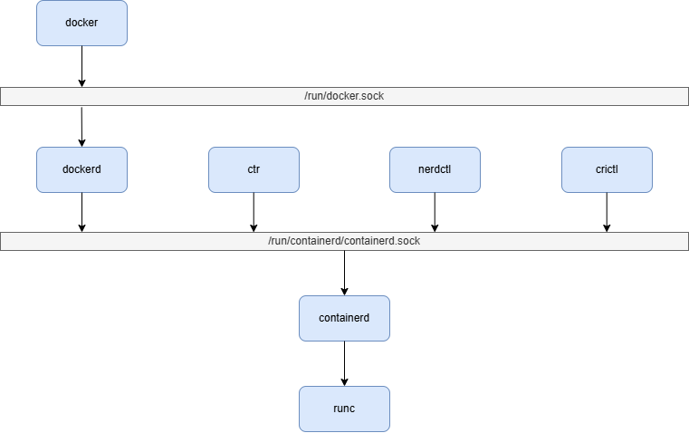

# ランタイム

Docker は既定で containerd と runc を使用する。



* ctr
  * containerd が提供する低レベルの CLI
* nerdctl
  * containerd が提供する docker 互換の CLI
* crictl
  * kuberntes が提供する [Container Runtime Interface](https://github.com/kubernetes/community/blob/master/contributors/devel/sig-node/container-runtime-interface.md) (CRI) 用の CLI
* containerd
  * コンテナのライフサイクルを管理するサービス
  * CRI を提供する。
* runc
  * Open Container Initiative (OCI) 仕様を実装したコンテナランタイム
  * 他に OCI を実装したランタイムは [Implementations](https://github.com/opencontainers/runtime-spec/blob/main/implementations.md) を参照

Docker のコンテナランタイムを確認する。

```sh
docker info -f "{{json .Runtimes}}" | jq -r ". | keys"
```

```json
[
  "io.containerd.runc.v2",
  "runc"
]
```

コンテナを起動する。

```sh
docker run --name test --rm -d redhat/ubi10 tail -f /dev/null
```

```text
18012482d7f76d4ee7b2cc77c34fb035655e48fc4bb955e63d4094cc999f9f01
```

runc で確認する。

```sh
sudo runc --root /run/docker/runtime-runc/moby/ list
```

```text
ID                                                                 PID         STATUS      BUNDLE                                                                                                                CREATED                          OWNER
18012482d7f76d4ee7b2cc77c34fb035655e48fc4bb955e63d4094cc999f9f01   3373        running     /run/containerd/io.containerd.runtime.v2.task/moby/18012482d7f76d4ee7b2cc77c34fb035655e48fc4bb955e63d4094cc999f9f01   2025-12-13T04:24:14.392298903Z   root
```

[ファイルシステムバンドル](https://github.com/opencontainers/runtime-spec/blob/main/bundle.md) を確認する。

```sh
sudo ls -l /run/containerd/io.containerd.runtime.v2.task/moby/18012482d7f76d4ee7b2cc77c34fb035655e48fc4bb955e63d4094cc999f9f01
```

```text
合計 32
-rw-r--r--. 1 root root  134 12月 13 13:24 bootstrap.json
-rw-r--r--. 1 root root 9720 12月 13 13:24 config.json
-rw-r--r--. 1 root root    4 12月 13 13:24 init.pid
prwx------. 1 root root    0 12月 13 13:24 log
-rw-r--r--. 1 root root    0 12月 13 13:24 log.json
-rw-------. 1 root root   82 12月 13 13:24 options.json
drwx--x--x. 2 root root   40 12月 13 13:24 rootfs
-rw-------. 1 root root    4 12月 13 13:24 runtime
-rw-------. 1 root root   32 12月 13 13:24 shim-binary-path
lrwxrwxrwx. 1 root root  119 12月 13 13:24 work -> /var/lib/containerd/io.containerd.runtime.v2.task/moby/18012482d7f76d4ee7b2cc77c34fb035655e48fc4bb955e63d4094cc999f9f01
```

ctr で確認する。

docker の namespace を確認する。

```sh
sudo ctr namespaces list
```

```text
NAME         LABELS
moby
moby_history
```

docker のコンテナを確認する。

```sh
sudo ctr --namespace moby containers list
```

```text
CONTAINER                                                           IMAGE                            RUNTIME
18012482d7f76d4ee7b2cc77c34fb035655e48fc4bb955e63d4094cc999f9f01    docker.io/redhat/ubi10:latest    io.containerd.runc.v2
```

## コンテナランタイム `crun`

C 言語で実装されたコンテナランタイムになる。

```sh
sudo dnf install -y crun
```

ランタイムに `crun` を追加する。

```sh
cat <<EOF | sudo tee /etc/docker/daemon.json
{
    "runtimes": {
        "crun": {
          "path": "$(command -v crun)"
        }
    }
}
EOF
```

docker を再起動する。

```sh
sudo systemctl restart docker
```

Docker のコンテナランタイムを確認する。

```sh
docker info -f "{{json .Runtimes}}" | jq -r ". | keys"
```

```json
[
  "crun",
  "io.containerd.runc.v2",
  "runc"
]
```

コンテナを起動する。

```sh
docker run --runtime crun --name test --rm -d redhat/ubi10 tail -f /dev/null
```

```text
0456984d35459c187a70d14950e4c9be13f3b2306b60076f39c0445fb11d5156
```

ctr で確認する。

```sh
sudo ctr --namespace moby containers list
```

```text
CONTAINER                                                           IMAGE                            RUNTIME
0456984d35459c187a70d14950e4c9be13f3b2306b60076f39c0445fb11d5156    docker.io/redhat/ubi10:latest    io.containerd.runc.v2
```

crun で確認する。

```sh
sudo crun --root /run/docker/runtime-runc/moby/ list
```

```text
NAME                                                             PID       STATUS   BUNDLE PATH                             CREATED                        OWNER
0456984d35459c187a70d14950e4c9be13f3b2306b60076f39c0445fb11d5156 4111      running  /run/containerd/io.containerd.runtime.v2.task/moby/0456984d35459c187a70d14950e4c9be13f3b2306b60076f39c0445fb11d5156 2025-12-13T05:06:34.771253Z    root
```

## 参考

* [Alternative container runtimes](https://docs.docker.com/engine/daemon/alternative-runtimes/)
