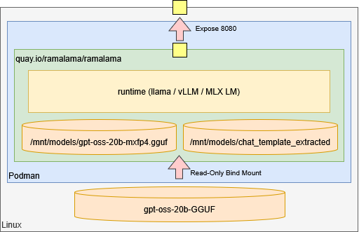

# 実行

RamaLama でコンテナを作成する。



## コンテナの実行

### アクセラレータ (AMD ROCm)

gpt-oss-20b を実行する。

```sh
ramalama run gpt-oss:20b
```

下記のエラーが発生する。

```text
load_tensors: loading model tensors, this can take a while... (mmap = true, direct_io = false)
load_tensors: offloading output layer to GPU
load_tensors: offloading 23 repeating layers to GPU
load_tensors: offloaded 25/25 layers to GPU
load_tensors:   CPU_Mapped model buffer size =   586.82 MiB
load_tensors:        ROCm0 model buffer size = 10949.38 MiB
Error: Command 'health check of container ramalama-7P7D7islax' timed out after 20 seconds
```

モデルを確認する。

```sh
ramalama list
```

[GGUF](https://github.com/ggml-org/ggml/blob/master/docs/gguf.md) (GGML Universal Format) 形式がダウンロードされる。

```text
NAME                           MODIFIED       SIZE
hf://ggml-org/gpt-oss-20b-GGUF 14 minutes ago 11.28 GB
```

コンテナを確認する。

```sh
ramalama ps
```

`quay.io/ramalama/rocm` イメージが起動している。

```text
CONTAINER ID  IMAGE                         COMMAND               CREATED        STATUS        PORTS                   NAMES
cc5dbeded764  quay.io/ramalama/rocm:latest  llama-server --ho...  7 minutes ago  Up 7 minutes  0.0.0.0:8080->8080/tcp  ramalama-7P7D7islax
```

ブラウザで接続すると llama.cpp が起動している。質問を入力するとコンテナがエラーを出力して停止した。

再度、コンテナを起動する。

```sh
ramalama serve gpt-oss:20b
```

```text
main: model loaded
main: server is listening on http://0.0.0.0:8080
main: starting the main loop...
srv  update_slots: all slots are idle
```

質問を入力するとコンテナがエラーを出力して停止した。

```text
rv  log_server_r: done request: GET / 192.168.0.38 200
srv  params_from_: Chat format: GPT-OSS
slot get_availabl: id  3 | task -1 | selected slot by LRU, t_last = -1
slot launch_slot_: id  3 | task -1 | sampler chain: logits -> ?penalties -> ?dry -> ?top-n-sigma -> top-k -> ?typical -> top-p -> min-p -> ?xtc -> temp-ext -> dist
slot launch_slot_: id  3 | task 0 | processing task, is_child = 0
slot update_slots: id  3 | task 0 | new prompt, n_ctx_slot = 131072, n_keep = 0, task.n_tokens = 69
slot update_slots: id  3 | task 0 | cache reuse is not supported - ignoring n_cache_reuse = 256
slot update_slots: id  3 | task 0 | n_tokens = 0, memory_seq_rm [0, end)
slot update_slots: id  3 | task 0 | prompt processing progress, n_tokens = 5, batch.n_tokens = 5, progress = 0.072464
/src/llama.cpp/ggml/src/ggml-cuda/ggml-cuda.cu:96: ROCm error
ggml_cuda_compute_forward: MUL_MAT failed
ROCm error: invalid device function
  current device: 0, in function ggml_cuda_compute_forward at /src/llama.cpp/ggml/src/ggml-cuda/ggml-cuda.cu:2751
  err
/lib64/libggml-base.so.0(+0x35a5) [0x7fc0e7f185a5]
/lib64/libggml-base.so.0(ggml_print_backtrace+0x1eb) [0x7fc0e7f1896b]
/lib64/libggml-base.so.0(ggml_abort+0x11f) [0x7fc0e7f18aef]
/usr/bin/libggml-hip.so(+0x1fc6b2) [0x7fc0c9b676b2]
/usr/bin/libggml-hip.so(+0x20618b) [0x7fc0c9b7118b]
/usr/bin/libggml-hip.so(+0x201b31) [0x7fc0c9b6cb31]
/lib64/libggml-base.so.0(ggml_backend_sched_graph_compute_async+0x7f3) [0x7fc0e7f337d3]
/lib64/libllama.so.0(_ZN13llama_context13graph_computeEP11ggml_cgraphb+0xa0) [0x7fc0e80106a0]
/lib64/libllama.so.0(_ZN13llama_context14process_ubatchERK12llama_ubatch14llm_graph_typeP22llama_memory_context_iR11ggml_status+0xe5) [0x7fc0e8012395]
/lib64/libllama.so.0(_ZN13llama_context6decodeERK11llama_batch+0x34f) [0x7fc0e8018ecf]
/lib64/libllama.so.0(llama_decode+0xe) [0x7fc0e801a81e]
llama-server() [0x522709]
llama-server() [0x56ae9f]
llama-server() [0x4888d2]
/lib64/libc.so.6(+0x35b5) [0x7fc0e798b5b5]
/lib64/libc.so.6(__libc_start_main+0x88) [0x7fc0e798b668]
llama-server() [0x48d355]
```

CPU-only を指定して起動するが同じ現象が発生する。

```sh
ramalama serve --ngl 0 gpt-oss:20b
```

```text
main: model loaded
main: server is listening on http://0.0.0.0:8080
main: starting the main loop...
srv  update_slots: all slots are idle
```

### アクセラレータなし (CPU)

`--ngl 0` の代わりに CPU のみ使用するイメージを指定する。

```sh
ramalama serve --image quay.io/ramalama/ramalama gpt-oss:20b
```

```text
main: model loaded
main: server is listening on http://0.0.0.0:8080
main: starting the main loop...
srv  update_slots: all slots are idle
```

[Open Responses](https://www.openresponses.org/) API を実行する。

```sh
curl \
    -H "Content-Type: application/json" \
    -d '{"input": "こんにちは"}' \
    -X POST \
    http://127.0.0.1:8080/v1/responses
```

```json
{
  "completed_at": 1771818660,
  "created_at": 1771818660,
  "id": "resp_2kToKxAFZ05VuF8KOJ9S6YQg95v5KOnP",
  "model": "ggml-org/gpt-oss-20b-GGUF",
  "object": "response",
  "output": [
    {
      "id": "rs_nHdoZR7TSf0bn0LjzWfHcDBlWGbhUkDd",
      "summary": [],
      "type": "reasoning",
      "content": [
        {
          "text": "User says \"こんにちは\" (Hello). Need to respond appropriately in Japanese, friendly. Probably ask how I can help.",
          "type": "reasoning_text"
        }
      ],
      "encrypted_content": "",
      "status": "completed"
    },
    {
      "content": [
        {
          "type": "output_text",
          "annotations": [],
          "logprobs": [],
          "text": "こんにちは！今日はどんなご用件でしょうか？お手伝いできることがあれば教えてくださいね。"
        }
      ],
      "id": "msg_0o2ZqbPeLgNl1j4wbIpHtQeDBeGedFg5",
      "role": "assistant",
      "status": "completed",
      "type": "message"
    }
  ],
  "status": "completed",
  "usage": {
    "input_tokens": 68,
    "output_tokens": 60,
    "total_tokens": 128
  }
}
```
